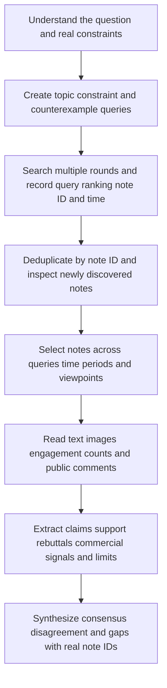

<div align="center">

<h1>Xiaohongshu Multi-Round Research</h1>

<p><strong>Read representative notes and public comments across queries, then connect consensus, disagreement, counterexamples, and evidence gaps to real sources</strong></p>

<p>
  <a href="CHANGELOG.md"></a>
  <a href="#access-boundary"></a>
  <a href="#research-workflow"></a>
  <a href="README.md"></a>
</p>

<p>
  <a href="#project-positioning">Positioning</a> ·
  <a href="#research-workflow">Workflow</a> ·
  <a href="#collection-policy">Collection policy</a> ·
  <a href="#confidence-model">Confidence</a> ·
  <a href="#link-security">Link safety</a> ·
  <a href="SECURITY.md">Security</a>
</p>

<p><a href="README.md">简体中文</a> · <a href="README.en.md">English</a></p>

</div>

<a id="project-positioning"></a>

## 1 Project positioning

This is the standalone Git repository for `$xiaohongshu-research`

The Skill lets an Agent use the user's already authenticated browser to search Xiaohongshu over multiple rounds, merge duplicate notes, read note text, images, and public comments, and produce research conclusions that trace back to real notes

The default backend is the installed `AIALRA Shopping Browser`, which provides an independent Chrome Model Context Protocol (MCP) connection

The Skill selects OpenCLI structured search, note, and comment capabilities only when the default plugin is unavailable before the first Xiaohongshu access and the user has already installed, connected, and trusted OpenCLI

Every search round and note detail records the backend that actually collected it, so final sources expose both the search backend and the detail backend

The Skill supports topics including travel, shopping, dining, accommodation, tutorials, trends, experiences, and risks

The entire workflow is read-only and never publishes, likes, saves, follows, comments, or sends direct messages

<div align="center">

Table 1.1 Project scope

| Item | Current value |
|---|---|
| Current version | `0.6.1`, from the repository `VERSION` file |
| Previous README version label | `0.3.0`, retained to show that the documentation had fallen behind |
| Primary deliverable | Traceable consensus, disagreement, counterexamples, and evidence gaps |
| Preferred backend | `aialra-shopping-browser` |
| Conditional backend | OpenCLI installed, connected, and trusted by the user before the run |
| Documentation languages | Chinese primary document and English mirror |

</div>

<a id="access-boundary"></a>

## 2 Research access boundary

- The Skill does not publish, like, save, follow, comment, or send direct messages
- The Skill does not install browser extensions, copy cookies, or grant OpenCLI permissions automatically
- The Skill does not use incognito browsers, proxy rotation, device-fingerprint disguise, or automated challenge solving
- The run pauses or stops when login, human verification, rate limiting, or host policy blocks access, and does not switch backends to bypass the block
- Engagement numbers describe attention and do not prove that a claim is correct

## 3 Research problem

The same Xiaohongshu topic can return different results across queries, rankings, and time periods

A popular note may also be outdated, commercially biased, missing important conditions, or supplemented and contradicted by its comments

The Skill does not treat one round, engagement numbers, or one note as consensus

It expands coverage first, reads representative notes and comments, and then separates consensus, disagreement, counterexamples, and evidence gaps

<a id="research-workflow"></a>

## 4 Complete workflow

<div align="center">



Figure 4.1 Read-only evidence workflow for Xiaohongshu multi-round research

</div>

Every collection node selects and records its backend according to [backend-routing.md](.agents/skills/xiaohongshu-research/references/backend-routing.md)

When OpenCLI is used, its action allowlist contains only `xiaohongshu.search`, `xiaohongshu.note`, and `xiaohongshu.comments`

Search, detail, and comment operations must return the same workflow-defined data structures regardless of the selected backend

<a id="collection-policy"></a>

## 5 Collection stopping policy

The following values come from `.agents/skills/xiaohongshu-research/workflow.yaml` and the `0.4.0` entry in `CHANGELOG.md`

<div align="center">

Table 5.1 Current collection limits

| Object | Current limit | Interpretation |
|---|---:|---|
| Query variants | `3` to `5` | Cover the topic, real constraints, and possible counterexamples |
| Search rounds | `3` to `5` | Record newly discovered unique notes in every round |
| Concurrent pages | At most `1` | Keep search and detail collection serial in one page |
| Detailed notes | At most `8` | Select representative sources across queries, time periods, and viewpoints |
| Public comments per note | At most `12` | Extract supporting, opposing, and supplementary evidence |
| Workflow nodes | At most `5` | Bound the execution graph |
| Total timeout | `2400` seconds | Prevent an unbounded run |

</div>

The result may be marked `saturated` when two consecutive rounds both add no more notes than the plan threshold

`saturated` means that another search under the current plan is likely to have low incremental value, not that Xiaohongshu has no other relevant content

The workflow also stops at the maximum round count, candidate limit, or total timeout while preserving evidence already collected

It pauses or stops immediately when login, human verification, or host security policy intervenes

<a id="confidence-model"></a>

## 6 Conclusion confidence

These thresholds come from the current workflow and the confidence guidance in the previous README

<div align="center">

Table 6.1 Conclusion confidence rules

| Level | Minimum evidence | Downgrade conditions |
|---|---|---|
| `high` | At least `3` independent authors support the claim | A material rebuttal exists, or the time period and research scope do not apply |
| `medium` | At least `2` independent sources support the claim | Minor recency, disagreement, or commercial-bias concerns exist |
| `low` | Only `1` source supports the claim | Evidence is outdated, conditions are unclear, or a material rebuttal exists |

</div>

Comments may support, contradict, or supplement note content, but they do not automatically represent broad consensus

## 7 Main files

<div align="center">

Table 7.1 Repository file responsibilities

| File | Purpose |
|---|---|
| `.agents/skills/xiaohongshu-research/SKILL.md` | Defines triggers and operating rules |
| `.agents/skills/xiaohongshu-research/workflow.yaml` | Fixes the five nodes, their order, executors, and stopping conditions |
| `.agents/skills/xiaohongshu-research/schemas/` | Defines the JavaScript Object Notation (JSON) data accepted and returned by each node |
| `.agents/skills/xiaohongshu-research/scripts/merge_rounds.py` | Merges multi-round results and selects notes for detail reading |
| `.agents/skills/xiaohongshu-research/scripts/validate_final.py` | Prevents nonexistent note citations and unjustified confidence upgrades |
| `.agents/skills/xiaohongshu-research/references/` | Explains multi-round collection, backend, and evidence-synthesis rules |
| `tests/` | Verifies multi-round merging, source tracing, confidence, and safety boundaries |

</div>

## 8 Installation and use

Run the installer from the repository root:

```bash
python3 scripts/install_local.py # Link the repository Skill into the personal Codex Skill directory
```

The installer links the repository Skill directory to `~/.codex/skills/xiaohongshu-research`

It does not copy cookies, browser profiles, or run records

Start a new Codex task and enter:

```text
# The following three lines form a natural-language task for Codex
Use $xiaohongshu-research to research worthwhile exhibitions in Tokyo during 2026
Run multiple searches and read representative notes and public comments
Separate recommendations pitfalls disagreements and claims that require official-source verification
```

The user must sign in to Xiaohongshu in Chrome first

The user personally completes sign-in, QR-code, slider, or CAPTCHA challenges when they appear

<a id="link-security"></a>

## 9 Link safety

Search-result links may contain temporary query parameters

The runtime stores only the note ID and outputs the canonical form `https://www.xiaohongshu.com/explore/<note-id>`

The repository and learning records must never store `xsec_token`

When a canonical detail link cannot be opened directly, the Agent returns to the search page and selects the corresponding card without copying the card's temporary link

Because page snapshots do not expose filenames, candidates, details, final results, and learning records retain only canonical links

## 10 Validation commands

```bash
python3 scripts/validate.py --ignore-core-lock # Check structure and contracts before an approved stable-core change
python3 -m unittest discover -s tests -v # Run domain runtime and safety-boundary tests
python3 scripts/check_secrets.py # Scan for suspected sensitive information
python3 .agents/skills/xiaohongshu-research/scripts/freeze_core.py # Generate a stable-core digest after an approved core change
python3 scripts/validate.py # Run full validation against the new digest
python3 .agents/skills/xiaohongshu-research/scripts/freeze_core.py --check # Confirm the stable-core digest
```

The first two commands check workflow and behavior, the third checks for suspected sensitive information, and the last three generate and confirm the stable-core digest

## 11 Project status

The following status comes from `VERSION`, `CHANGELOG.md`, the current workflow, `SECURITY.md`, and the repository-root license check

<div align="center">

Table 11.1 Public delivery boundary

| Object | Current status | Adoption boundary |
|---|---|---|
| Skill version | `0.6.1` | Review `CHANGELOG.md` before use when version changes matter |
| Platform operations | Read-only | Publishing, engagement, and messaging are outside the current scope |
| Backend selection | Fixed before first access | A policy block never triggers a switch to another execution surface |
| Link data | Canonical links only | Temporary tokens in candidates, results, or learning records are rejected |
| Login data | Stored outside the repository | Cookies, passwords, verification data, and browser profiles must never be committed |
| Repository license | Not provided | Public visibility does not automatically grant rights to copy, modify, redistribute, or use commercially |

</div>

See [SECURITY.md](SECURITY.md) for the complete security rules

The repository does not store cookies, passwords, verification data, browser profiles, temporary query tokens, complete tool output, direct messages, or unredacted run artifacts
