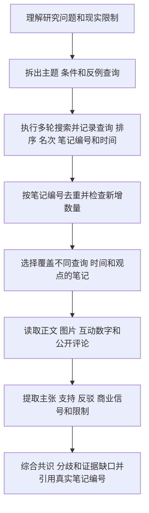

<div align="center">

<h1>小红书多轮研究</h1>

<p><strong>跨查询读取代表性笔记和公开评论，把共识、分歧、反例和证据缺口连回真实来源</strong></p>

<p>
  <a href="CHANGELOG.md"></a>
  <a href="#access-boundary"></a>
  <a href="#research-workflow"></a>
  <a href="README.en.md"></a>
</p>

<p>
  <a href="#project-positioning">项目定位</a> ·
  <a href="#research-workflow">完整流程</a> ·
  <a href="#collection-policy">采集停止</a> ·
  <a href="#confidence-model">置信度</a> ·
  <a href="#link-security">链接安全</a> ·
  <a href="SECURITY.md">安全规则</a>
</p>

<p><a href="README.md">简体中文</a> · <a href="README.en.md">English</a></p>

</div>

<a id="project-positioning"></a>

## 1 项目定位

这是 `$xiaohongshu-research` 的独立 Git 仓库

这个 Skill 让 Agent 使用用户已经登录的浏览器多轮搜索小红书

它会合并重复笔记，读取正文、图片和公开评论，再输出能够反向追溯到笔记的研究结论

默认后端是已经安装的 `AIALRA Shopping Browser` 独立 Chrome MCP 模型上下文协议（Model Context Protocol）

只有该插件在第一次访问小红书前不可用，并且用户已经安装、连接和信任 OpenCLI 时，Skill 才会选择 OpenCLI 的结构化搜索、笔记和评论能力

每轮结果和每个详情都会记录实际采集后端，最终来源可以直接看到搜索来源和详情来源

Skill 适用于旅游、购物、餐饮、住宿、教程、趋势、经验和风险等主题

Skill 全程只读，不发布、不点赞、不收藏、不关注、不评论、不私信

<div align="center">

表 1.1 项目范围

| 项目 | 当前内容 |
|---|---|
| 当前版本 | `0.6.1`，来源为仓库 `VERSION` 文件 |
| 旧 README 版本标记 | `0.3.0`，保留用于说明文档曾经滞后 |
| 主要交付物 | 可追溯的共识、分歧、反例和证据缺口 |
| 首选后端 | `aialra-shopping-browser` |
| 条件后端 | 用户预先安装、连接和信任的 OpenCLI |
| 文档语言 | 简体中文主文档和英文镜像 |

</div>

<a id="access-boundary"></a>

## 2 研究权限边界

- Skill 不会发布、点赞、收藏、关注、评论或私信
- Skill 不会安装浏览器扩展、复制 Cookie 或自动授予 OpenCLI 权限
- Skill 不会使用隐身浏览器、代理轮换、设备指纹伪装或验证码自动处理
- 登录、人机检查、限流和宿主策略阻止出现后，运行会暂停或停止，不会更换后端绕过
- 互动数字只描述热度，不证明事实正确

## 3 研究问题

小红书同一个主题在不同查询、排序和时间下会返回不同结果

单篇热门笔记也可能陈旧、带有商业倾向、缺少条件或被评论补充和反驳

Skill 不把单轮结果、热度数字或一篇笔记直接当作共识

它先扩大覆盖，再读取代表性笔记和评论，最后区分共识、分歧、反例和证据缺口

<a id="research-workflow"></a>

## 4 完整流程

<div align="center">



图 4.1 小红书多轮研究的只读证据流程

</div>

每个采集节点都会按照 [backend-routing.md](.agents/skills/xiaohongshu-research/references/backend-routing.md) 确定并记录后端

使用 OpenCLI 时，动作白名单只包含 `xiaohongshu.search`、`xiaohongshu.note` 和 `xiaohongshu.comments`

无论使用哪一种后端，搜索、详情和评论都必须返回工作流规定的相同数据结构

<a id="collection-policy"></a>

## 5 采集停止规则

以下数值来自 `.agents/skills/xiaohongshu-research/workflow.yaml` 和 `CHANGELOG.md` 的 `0.4.0` 记录

<div align="center">

表 5.1 当前采集范围

| 对象 | 当前范围 | 当前解释 |
|---|---:|---|
| 查询变体 | `3` 至 `5` 个 | 覆盖主题、现实限制和潜在反例 |
| 搜索轮次 | `3` 至 `5` 轮 | 每轮记录首次出现的唯一笔记数量 |
| 并行页面 | 最多 `1` 页 | 搜索和详情保持单页面串行 |
| 详情笔记 | 最多 `8` 篇 | 选择不同查询、时间和观点的代表性来源 |
| 每篇公开评论 | 最多 `12` 条 | 提取支持、反驳和补充信息 |
| 工作流节点 | 最多 `5` 个 | 限制执行图规模 |
| 总时限 | `2400` 秒 | 阻止任务无限运行 |

</div>

连续两轮的新增笔记都不超过计划阈值时，结果可以标记为 `saturated`

`saturated` 表示当前计划继续搜索的新增收益较低，不表示小红书没有其他内容

达到最大轮次、候选上限或总时限时也会停止，并保留已经取得的证据

登录、验证码或宿主安全策略出现时立即暂停或停止

<a id="confidence-model"></a>

## 6 结论置信度

以下阈值来自当前工作流和旧版 README 的置信度说明

<div align="center">

表 6.1 结论置信度规则

| 级别 | 最小证据 | 降级条件 |
|---|---|---|
| `high` | 至少 `3` 个独立作者支持 | 存在重要反驳，或时间和研究范围不适用 |
| `medium` | 至少 `2` 个独立来源支持 | 存在轻微时效、分歧或商业倾向问题 |
| `low` | 只有 `1` 个来源 | 证据陈旧、条件不清或存在重要反驳 |

</div>

评论可以支持、反驳或补充正文，也不能自动代表普遍共识

## 7 主要文件

<div align="center">

表 7.1 仓库文件职责

| 文件 | 用途 |
|---|---|
| `.agents/skills/xiaohongshu-research/SKILL.md` | 定义触发条件和运行规则 |
| `.agents/skills/xiaohongshu-research/workflow.yaml` | 固定五个节点、顺序、执行器和停止条件 |
| `.agents/skills/xiaohongshu-research/schemas/` | 规定每个节点可以接收和返回的 JSON 轻量数据交换格式（JavaScript Object Notation） |
| `.agents/skills/xiaohongshu-research/scripts/merge_rounds.py` | 合并多轮结果并选择详情笔记 |
| `.agents/skills/xiaohongshu-research/scripts/validate_final.py` | 防止引用不存在的笔记或虚假提高置信度 |
| `.agents/skills/xiaohongshu-research/references/` | 解释多轮采集、后端和证据综合规则 |
| `tests/` | 验证多轮合并、来源追溯、置信度和安全边界 |

</div>

## 8 安装使用

在仓库根目录安装：

```bash
python3 scripts/install_local.py # 把仓库中的 Skill 链接到 Codex 的个人 Skill 目录
```

安装器会把本仓库中的 Skill 目录链接到 `~/.codex/skills/xiaohongshu-research`

它不会复制 Cookie、浏览器配置或运行记录

新建 Codex 任务并输入：

```text
# 以下三行是提交给 Codex 的自然语言任务
使用 $xiaohongshu-research 研究 2026 年东京值得去的展览
执行多轮搜索，读取代表性笔记和公开评论
区分推荐、避坑、分歧和需要去官方来源二次确认的信息
```

用户需要先在 Chrome 中登录小红书

出现登录、扫码、滑块或验证码时由用户亲自完成

<a id="link-security"></a>

## 9 链接安全

搜索结果链接可能包含临时查询参数

运行时只保存笔记 ID，并输出 `https://www.xiaohongshu.com/explore/<note-id>` 形式的规范链接

仓库和学习记录不得保存 `xsec_token`

规范详情链接显示不可用时，Agent 会返回搜索页并点击对应卡片，不复制卡片临时链接

页面快照不提供文件名，候选、详情、最终结果和学习记录只保存规范链接

## 10 验证命令

```bash
python3 scripts/validate.py --ignore-core-lock # 修改稳定核心前检查结构和契约
python3 -m unittest discover -s tests -v # 运行领域、运行时和安全边界测试
python3 scripts/check_secrets.py # 扫描疑似敏感信息
python3 .agents/skills/xiaohongshu-research/scripts/freeze_core.py # 在获准修改核心后生成新的稳定摘要
python3 scripts/validate.py # 使用新摘要执行完整验证
python3 .agents/skills/xiaohongshu-research/scripts/freeze_core.py --check # 复核稳定核心摘要
```

前两条命令检查工作流和行为，第三条命令检查疑似敏感信息，后三条命令生成并复查稳定核心摘要

## 11 项目状态

以下状态来自 `VERSION`、`CHANGELOG.md`、当前工作流、`SECURITY.md` 和根目录许可证检查

<div align="center">

表 11.1 公开交付边界

| 对象 | 当前状态 | 采用边界 |
|---|---|---|
| Skill 版本 | `0.6.1` | 使用前可以通过 `CHANGELOG.md` 核对变化 |
| 平台操作 | 只读 | 发布、互动和私信不在当前范围内 |
| 后端选择 | 第一次访问前固定 | 策略阻止以后不会切换执行面 |
| 链接数据 | 只保存规范链接 | 临时令牌进入候选、结果或学习记录时会被拒绝 |
| 登录数据 | 仓库外保存 | Cookie、密码、验证码和浏览器资料禁止提交 |
| 仓库许可证 | 未提供 | 公开可见不自动授予复制、修改、再分发或商业使用权 |

</div>

详细安全规则见 [SECURITY.md](SECURITY.md)

仓库不保存 Cookie、密码、验证码、浏览器配置、临时查询令牌、完整工具输出、私信或未脱敏运行产物
