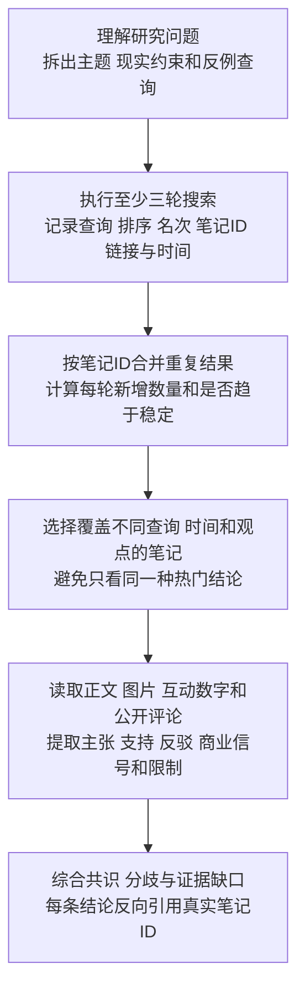

# 小红书多轮研究

## 这个仓库是什么

这是 `$xiaohongshu-research` 的独立 Git 仓库

它让 Agent 使用用户已经登录的浏览器多轮搜索小红书，合并重复笔记，读取正文、图片和公开评论，再输出可以反向追溯到笔记的研究结论

用户已经安装并信任 OpenCLI 时优先复用其结构化搜索、笔记和评论能力

OpenCLI 不可用时使用 Codex 支持的 Chrome 能力，研究流程和质量标准保持不变

每轮结果和每个详情都会记录实际采集后端，最终来源可以直接看到搜索来源与详情来源

本 Skill 适用于旅游、购物、餐饮、住宿、教程、趋势、经验与风险等主题

本 Skill 全程只读，不发布、不点赞、不收藏、不关注、不评论、不私信

## 它解决什么问题

小红书同一个主题在不同查询、排序和时间下会返回不同结果

单篇热门笔记也可能陈旧、带有商业倾向、缺少条件或被评论补充和反驳

本 Skill 不把单轮结果、热度数字或一篇笔记直接当作共识

它先扩大覆盖，再读取代表性笔记和评论，最后区分共识、分歧、反例与证据缺口

## 完整流程



每个采集节点都会先检查 OpenCLI 是否已经安装、连接并获得用户信任

满足条件时只调用 `xiaohongshu.search`、`xiaohongshu.note` 与 `xiaohongshu.comments`

不满足条件时直接使用受支持 Chrome，不安装扩展，不复制 Cookie

完整规则见 [采集后端路由](.agents/skills/xiaohongshu-research/references/backend-routing.md)

## 多轮搜索怎样停止

至少执行三轮

每一轮都记录第一次出现的唯一笔记数量

连续两轮的新增笔记都不超过计划阈值时，结果可以标记为 `saturated`

`saturated` 表示当前计划继续搜索的新增收益较低，不表示小红书没有其他内容

达到最大轮次、候选上限或总时限时也会停止，并保留已经取得的证据

登录、验证码或宿主安全策略出现时立即暂停

## 结论怎样获得置信度

- `high` 至少需要三个独立作者的笔记支持，没有重要反驳，时间与研究范围适用
- `medium` 至少需要两个独立来源支持，或存在轻微时效、分歧或商业倾向问题
- `low` 只有一个来源、证据陈旧、条件不清或存在重要反驳

互动数字只描述热度，不证明事实正确

评论可以支持、反驳或补充正文，也不能自动代表普遍共识

## 主要文件

| 文件 | 用途 |
| --- | --- |
| `.agents/skills/xiaohongshu-research/SKILL.md` | 告诉 Agent 何时触发与怎样运行 |
| `.agents/skills/xiaohongshu-research/workflow.yaml` | 固定五个节点、顺序、执行器与停止条件 |
| `.agents/skills/xiaohongshu-research/schemas/` | 规定每个节点可以接收和返回的 JSON |
| `.agents/skills/xiaohongshu-research/scripts/merge_rounds.py` | 合并多轮结果并选择详情笔记 |
| `.agents/skills/xiaohongshu-research/scripts/validate_final.py` | 防止结论引用不存在的笔记或虚假提高置信度 |
| `.agents/skills/xiaohongshu-research/references/` | 解释多轮采集和证据综合规则 |
| `tests/` | 验证多轮合并、来源追溯、置信度与安全边界 |

## 本地安装

```bash
python3 scripts/install_local.py
```

安装器会把本仓库中的 Skill 目录链接到 `~/.codex/skills/xiaohongshu-research`

它不会复制 Cookie、浏览器配置或运行记录

## 使用示例

```text
使用 $xiaohongshu-research 研究 2026 年东京值得去的展览
执行多轮搜索，读取代表性笔记和公开评论
区分推荐、避坑、分歧和需要去官方来源二次确认的信息
```

用户需要先在 Chrome 中登录小红书

出现登录、扫码、滑块或验证码时由用户亲自完成

## 链接处理

搜索结果链接可能包含临时查询参数

运行时只保存笔记 ID，并输出 `https://www.xiaohongshu.com/explore/<note-id>` 形式的规范链接

仓库和学习记录不得保存 `xsec_token`

## 验证命令

```bash
python3 scripts/validate.py --ignore-core-lock
python3 -m unittest discover -s tests -v
python3 scripts/check_secrets.py
python3 .agents/skills/xiaohongshu-research/scripts/freeze_core.py
python3 scripts/validate.py
python3 .agents/skills/xiaohongshu-research/scripts/freeze_core.py --check
```

前两条检查工作流和行为

第三条检查疑似敏感信息

后三条生成并复查稳定核心摘要

## 安全边界

详细规则见 [SECURITY.md](SECURITY.md)

仓库不保存 Cookie、密码、验证码、浏览器配置、临时查询令牌、完整工具输出、私信或未脱敏运行产物

不使用隐身浏览器、代理轮换、设备指纹伪装或验证码自动处理

## 当前版本

当前版本为 `0.3.0`

版本变化见 [CHANGELOG.md](CHANGELOG.md)
